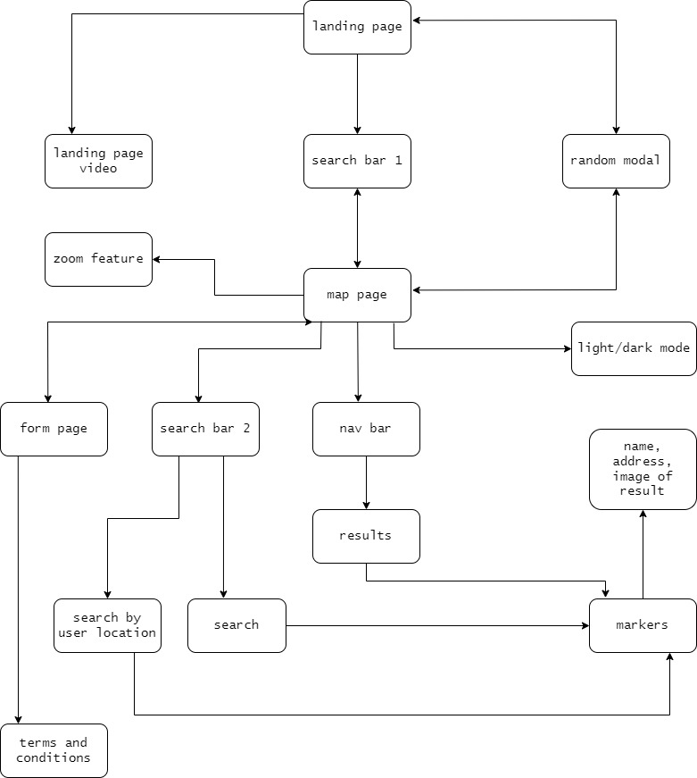

# Get Moving

The live demo can be found [here](https://caracara6.github.io/get_moving/).

## Project Summary

### Premise

_Get Moving_ is a website which allows users to easily search public- and private-owned sports facilities in Singapore.

### User Goals

* Target audience: 
    1. Anyone interested in leading a more active lifestyle, with a positive attitude to sports and keeping fit
    2. People who may be interested in trying new sporting activities
    3. Tertiary students to working adults
    4. Target age demographics is a wide range from 18 years old to 60 years old
    5. No specific target ethnicity

* Characteristics:
    1. Attitude: motivated to keep fit/make new friends through working out
    * _Health is wealth_
    2. Behaviour: May lead either active or sedentary lifestyles

* Suggest a new sport/activity to users, allowing users to immerse in something fresh to them
* Search for the nearest sport facility to their location
* Work in progress - find a workout partner 

### Organisational Goals

* The app aims to consolidate and locate all sports facilities in Singapore, and help meet user goals with an easy-to-use and responsive interface.

### Justification for the site

* The app helps users easily locate the nearest sports facility to them, as well as all around Singapore. Users can also be matched with suitable partners for sports which are more meaningful when played with one or more person.

## UI/UX

### User stories and acceptance criteria

User Stories | Acceptance Criteria
------------ | ------------
As a user who is keen in keeping fit, I want to be able to know the nearest gym/suitable facilities to me, so that I can work out at my convenience. | Location services help to determine the nearest search results to user, including both government-owned and commercial facilities.
As a user who mostly exercises in the gym, I want suggestions of new sports/activities, so that I can discover new ways of keeping fit. | App randomly suggests new activities from a local data resource, and displays the matching locations and information on the map.

### Five Planes of UI/UX

#### Strategy

* B2C (Business to User)

* User: People who wish to be/stay physically active

* User Needs: Find nearest/try undiscovered sports facilities

* User Pain Points: 
> * No consolidated resource of all sports facilites in Singapore, thus have to Google for their location separately.

#### Scope

_Functional Requirements_
* Search for sports facilities
* Search by facility location
* Search by user location
* Use pre-defined filters to view locations
* Push random sports suggestions
* Allow users to fill in particulars for possible match with a partner

_Content requirements_
* Name of sports facility
* Address of sports facility
* Image of sports facility

_Non-functional requirements_
* Light and dark selection for map 
* Mobile responsiveness

#### Structure

 

* The _Get Moving_ app uses a tree hierarchy structure.

* Users can utilise the search function on both the landing and the map page.

* The random sports suggestion feature on the landing page will bring the user to the map page should they agree to explore(i.e. the 'Let's Go' button).

* The form can only be accessed from the map page, and users can only submit the form after agreeing to the terms and conditions.

#### Skeleton

Wireframes for mobile and laptop display for the website are [here](wireframes/get_moving_wireframe.pdf)

#### Surface

_Colour Scheme_

 

* The app mainly utilises neutral colours of black, grey and white, which can draw users in to focus on the defining, important components of the app.

* The accent colours of red and pale-red were chosen as this colour is associated with passion, zeal, and energy, which ties in with the app's overall theme.

_Font Choice_

* The brand name's font is Artega, a blocky sans-serif font which looks modern and powerful.

* Components on the app with smaller font-size, such as the error messages, are displayed with Taviraj. This serif font-choice allows for better readability.

* Other components such as buttons utilise Roboto Mono, a clean and elegant font for a clearer call to action.

* Instead of words, easy-to-interpret icons for different sports are used for the navbar. Together with their jump function, they cut through the seriousness of the monochrome colours with a touch of playfulness.

## Technologies Used

* HTML5 (HyperText Markup Language)
    * Created web app framework

* CSS (Cascading Style Sheets)
    * Used to style the elements of the app

* [Bootstrap 5.1](https://getbootstrap.com/docs/5.0/getting-started/introduction/)
    * Used to create main components such as results display and buttons, and to direct layout with grid system

* Javascript
    * Used for dynamic action and more user interaction 

* [Leaflet](https://leafletjs.com/)
    * Used to create the map feature

* [Leaflet Cluster](https://github.com/Leaflet/Leaflet.markercluster)
    * Clustering plugin for leaflet

* [Mapbox](https://www.mapbox.com/)
    * Used to provide tile layers on map

* [Foursquare API](https://developer.foursquare.com/)
    * Access to data

* [Axios](https://www.npmjs.com/package/axios)
    * HTTP Client for browser

* [Font Awesome](https://fontawesome.com/)
    * Used free icons in navbar

* [diagrams.net](https://app.diagrams.net/)
    * Used to draw UI/UX Structure flowchart

## Deployment

The web app is hosted on [GitHub Pages](https://pages.github.com/)

## Limitations

* Due to the scope limitation of this project, user particulars are not being processed in the backend

* Foursquare API key is visible to all internet traffic

* Not all search results return a photo, in which case a default photo will be used. However, this may not be meaningful to that particular search result. 

* Local data of the random array of sports has to be updated manually and in a timely manner

## Attribution

#### Data
* [Data.gov.sg](https://data.gov.sg/)

#### Fonts
* [Google Fonts](https://fonts.google.com/)
* [Creative Fabrica](https://www.creativefabrica.com/)

#### Photos
* [Pexels](https://www.pexels.com/)

#### Videos
* [Videvo](https://www.videvo.net/)

#### Guidance
* Ace and Razia for being amazing TAs
